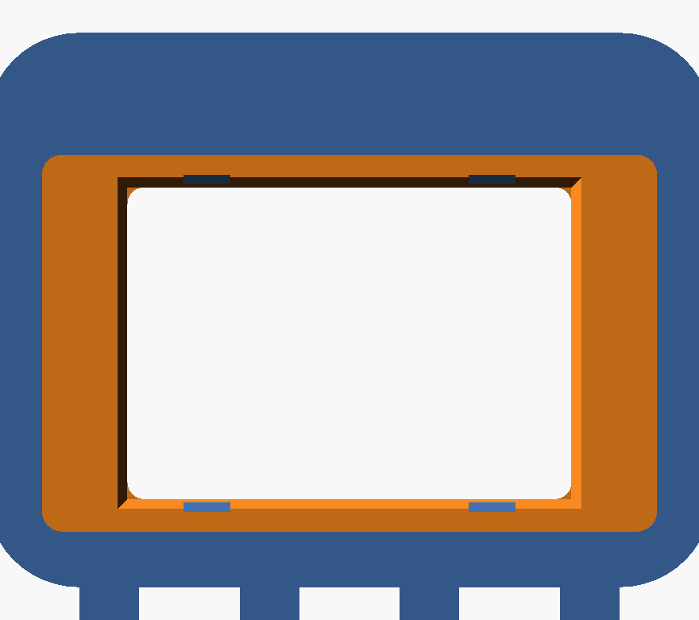

# Carcaça Clawd para a CYD ESP32-2432S028

O bichinho do Claude com a tela no lugar da barriga. Duas peças, **encaixe por
pressão, sem parafuso**, e nenhuma delas precisa de suporte para imprimir.

 

| Arquivo | O que é | Tamanho |
|---|---|---|
| [`corpo.stl`](corpo.stl) | o bichinho, com a cara e a janela da tela | 109,6 × 91,6 × 15,0 mm |
| [`tampa.stl`](tampa.stl) | fecha as costas e prende a placa | 92,5 × 56,5 × 5,7 mm |
| [`teste.stl`](teste.stl) | **imprima esta primeira** — confere o encaixe | 91,6 × 55,6 × 10,0 mm |
| [`clawd_cyd.scad`](clawd_cyd.scad) | a fonte paramétrica, para ajustar folgas | — |

---

## Antes de imprimir a peça inteira

**Imprima o `teste.stl`.** São cerca de 10 minutos e 3 g de filamento. Ele
reproduz a cavidade do PCB, duas abas de retenção e a abertura do USB — nada
mais. Se a placa entra e trava nele, entra na carcaça.

Isso não é excesso de zelo. As medidas da placa aqui são as **publicadas** para
a ESP32-2432S028, não medidas nesta unidade com paquímetro:

```
PCB                86 × 50 × 1,6 mm
módulo da tela     70 × 50 mm, sobressaindo 4 mm da face do PCB
área visível       59,5 × 45 mm
componentes atrás  até 4,8 mm (botões e conector do alto-falante)
```

E há duas coisas que **não** encontrei publicadas, então o modelo não depende
delas:

- **a posição dos furos de fixação** — não existe furo nenhum na peça; a placa é
  presa por quatro abas elásticas nas bordas;
- **a posição exata do conector USB ao longo da borda** — a abertura cobre 26 mm
  da lateral esquerda, então acerta o conector onde quer que ele esteja.

A posição da área visível dentro do módulo também não é publicada. Em vez de
supor, a janela expõe o módulo quase inteiro (67 × 47 mm) e o rebaixo segura a
borda dele — assim a área visível cai dentro da janela em qualquer posição
plausível. O que aparece a mais é a moldura preta do próprio módulo.

Se a placa ficar apertada no teste, abra o `.scad` e aumente `fit` de `0.4` para
`0.6`. Se ficar frouxa, baixe para `0.3`. É um número só, no topo do arquivo.

---

## Impressão

As duas peças foram desenhadas para imprimir **deitadas e sem suporte nenhum**.
Todo vão para cima tem chanfro de 45°, que é auto-sustentável.

| | Orientação |
|---|---|
| `corpo` | **cara para baixo** na mesa (a cavidade abre para cima) |
| `tampa` | face lisa para baixo |

```
bico       0,4 mm
camada     0,2 mm
perímetros 3
preenchim. 15%
suporte    NENHUM
balsa      não
material   PLA ou PETG
```

PETG deixa as abas e os clipes mais tolerantes a repetidas aberturas; PLA
imprime melhor os detalhes da cara. Para uso na mesa, PLA basta.

Com a cara para baixo, a superfície que se olha sai lisa como o vidro da mesa —
é o melhor acabamento que a impressora consegue, e é de graça.

---

## Montagem

1. Encaixe a placa **por trás**, com a tela virada para a janela. Empurre até as
   quatro abas passarem por cima da face traseira do PCB — dá para ouvir.
2. Passe o cabo USB pela abertura da lateral esquerda.
3. Encaixe a tampa no rebaixo das costas e pressione até os dois clipes
   travarem.

Para tirar: encoste uma espátula fina na fresta lateral da tampa e force os
clipes para dentro, um de cada vez.

### Sobre o cabo

O USB da CYD fica na **borda**, não nas costas. Com um cabo comum, ele sai pela
lateral esquerda — que é o caminho natural.

O canal nas costas da tampa serve para quem usa um **adaptador USB em 90°**
(aqueles cotovelos baratos de AliExpress). Com ele o cabo desce por trás do
bichinho e some da vista, que era a ideia. Sem o adaptador não há espaço interno
para dobrar o cabo, e forçar isso só quebraria o conector — por isso o canal é
uma opção, não o caminho padrão.

---

## Regenerar

```bash
./build.sh              # Linux, macOS, Git Bash
```

ou peça a peça:

```bash
openscad --export-format binstl -o corpo.stl -D 'part="corpo"' clawd_cyd.scad
openscad --export-format binstl -o tampa.stl -D 'part="tampa"' clawd_cyd.scad
openscad --export-format binstl -o teste.stl -D 'part="teste"' clawd_cyd.scad
```

Instalar o OpenSCAD, se precisar: `winget install OpenSCAD.OpenSCAD` no Windows,
`brew install --cask openscad` no macOS.

---

## Parâmetros que valem mexer

Tudo no topo do [`clawd_cyd.scad`](clawd_cyd.scad), com comentário explicando o
porquê de cada um. Os que mais importam:

| Parâmetro | Padrão | Para quê |
|---|---|---|
| `fit` | `0.4` | folga por lado do PCB. **É o primeiro a ajustar** |
| `tab_grip` | `1.4` | quanto as abas avançam. Pega real = `tab_grip − fit` |
| `usb_open_w` | `26.0` | largura da abertura do USB |
| `top_pad` | `19.0` | borda de cima; é o que dá espaço aos olhos |
| `side_pad` / `bot_pad` | `9.0` | bordas dos lados e de baixo |
| `leg_n` / `leg_w` / `leg_h` | `4` / `9` / `8` | as perninhas |
| `eye_w` / `eye_h` / `eye_gap` | `8` / `11` / `40` | os olhos |

Diminuir `side_pad`, `top_pad` e `bot_pad` deixa a peça menor, mas abaixo de
~7 mm a parede fica fina demais para segurar as abas com firmeza.

---

## Verificação

As três malhas foram conferidas depois de geradas, não apenas modeladas:

```
corpo.stl    1640 tri | 109,60 × 91,60 × 15,00 mm | malha fechada
tampa.stl     544 tri |  92,45 × 56,45 ×  5,70 mm | malha fechada
teste.stl     416 tri |  91,60 × 55,60 × 10,00 mm | malha fechada
```

"Malha fechada" quer dizer que toda aresta tem par — sem furo, sem face solta,
sem normal invertida. É o que os fatiadores reclamam quando um STL vem torto.

O que **não** foi verificado, e só a impressão diz: se a placa desta unidade
entra na folga de 0,4 mm. Daí o `teste.stl`.
